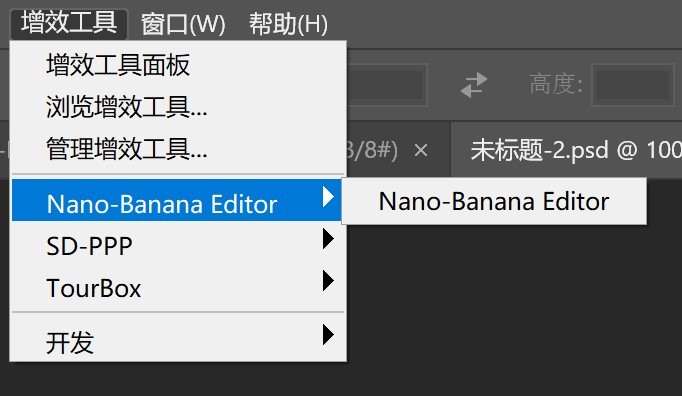
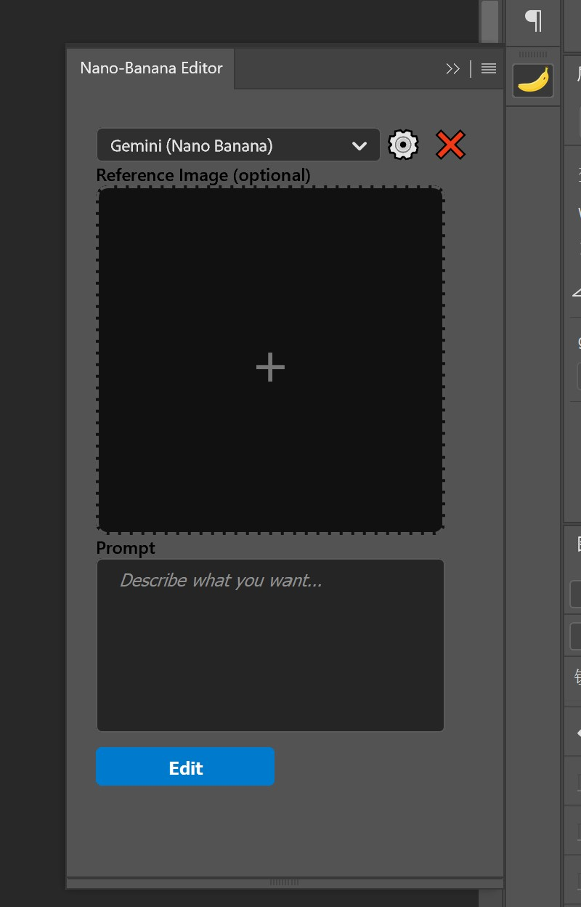
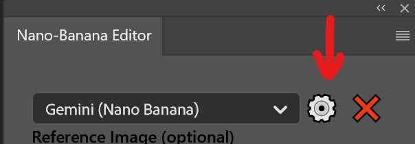
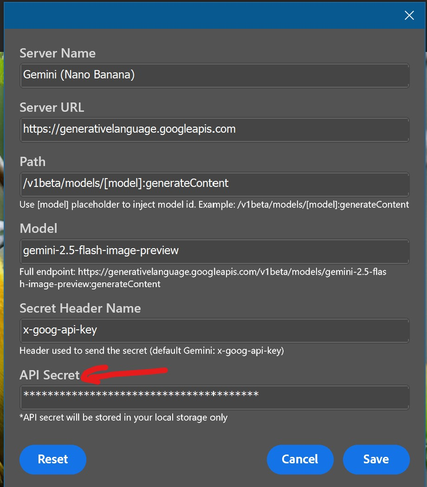
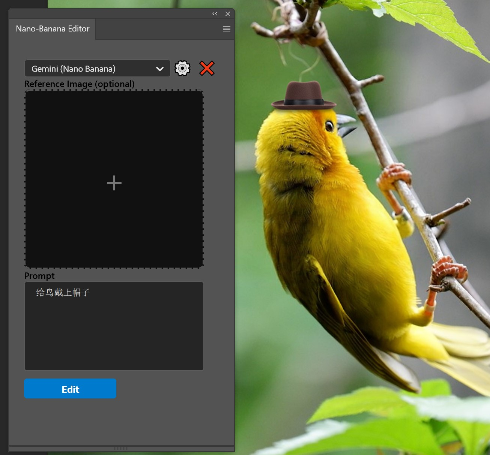
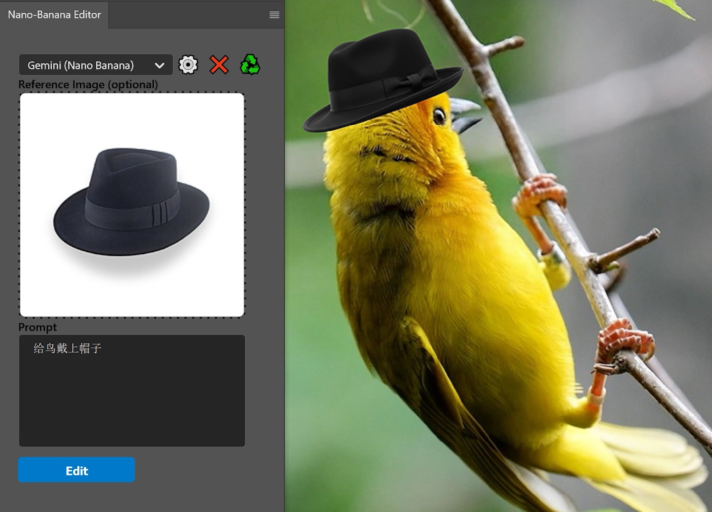

# Nano Banana PS Plugin
AI Inpainting inside Adobe Photoshop (Google "Nano Banana" Model)

在 Photoshop 中使用 Google「Nano Banana」模型的 AI 局部填充插件

---

[Direct Download / 直接下载](https://github.com/jeffgyf/nano-banana-ps-plugin/releases/download/v0.0.1-alpha/nano-banana-editor.ccx)

[All Releases / 全部版本](https://github.com/jeffgyf/nano-banana-ps-plugin/releases)

---

## English

Requirement: Adobe Photoshop 2022 (v23) or newer (UXP plugin support required).

### Install
Creative Cloud (recommended)
1. Download the .ccx file (Releases).
2. Double‑click to install via Creative Cloud.
3. Restart Photoshop if it was open.
4. Open: Window > Extensions (UXP) > Nano Banana Inpaint.

Manual (no Creative Cloud)
1. Rename: nano-banana-ps-plugin.ccx → nano-banana-ps-plugin.zip
2. Unzip.
3. Copy the extracted folder into your Photoshop installation directory:
	- Windows: <PHOTOSHOP_INSTALL_DIR>\\Plug-ins\\  (or \\Plug-ins\\Generator\\)  
	  e.g. C:\\Program Files\\Adobe\\Adobe Photoshop 2024\\Plug-ins\\
	- macOS: <PHOTOSHOP_APP_DIR>/Plug-ins/  (or /Plug-ins/Generator/)  
	  e.g.: /Applications/Adobe Photoshop 2024/Plug-ins/
4. Restart Photoshop.
5. Access the plugin from the Plugins / Extensions menu (depending on build).

### Usage
1. Open from Plug-ins menu: Plug-ins > Nano-Banana Editor.
   
	
	
2. Click the gear (settings) icon and enter your Gemini API key (stored locally only).
   
	

	
3. Make a selection with any selection tool. (Optional) Click + in the panel to add a reference image.
4. Type a prompt, e.g. "add a hat to the bird" and press Edit / Generate.
5. Wait a few seconds; the edited result is inserted as a new layer.
   
	
	

---

## 中文

环境要求：需 Adobe Photoshop 2022 (v23) 或更高版本（支持 UXP 插件）。

### 安装
Creative Cloud（推荐）
1. 下载发布页 .ccx 文件
2. 双击自动安装
3. 若已打开 Photoshop 请重启
4. 打开：窗口 > 扩展(UXP) > Nano Banana Inpaint

手动安装（无 Creative Cloud 客户端）
1. 重命名：nano-banana-ps-plugin.ccx → nano-banana-ps-plugin.zip
2. 解压
3. 将解压后的文件夹复制到 Photoshop 安装目录下的 Plug-ins 或 Plug-ins/Generator 目录：
	- Windows：<PS_安装目录>\\Plug-ins\\ （或 \\Plug-ins\\Generator\\）  
	  示例：C:\\Program Files\\Adobe\\Adobe Photoshop 2024\\Plug-ins\\
	- macOS：<PS_应用目录>/Plug-ins/ （或 /Plug-ins/Generator/）  
	  示例：/Applications/Adobe Photoshop 2024/Plug-ins/
4. 重启 Photoshop
5. 在 插件 / 扩展 菜单中查看（视版本而定）

### 使用
1. 在 “增效工具 (Plug-ins)” 菜单下找到 “Nano-Banana Editor” 并点击，插件 UI 将打开。
   
	
	
2. 点击齿轮形设置按钮，在弹出的设置界面中输入你的 Gemini API Key（仅保存在本地）。
   
	

	
3. 使用 “选择工具” 或 “选区画笔” 选中任意区域，点击插件面板中的 “+” 号可添加参考图片（可选）。
4. 在 prompt 区域写入修改需求，例如 “给鸟戴上帽子”，点击 Edit 生成。
5. 等待数秒，生成结果会自动作为新图层插入。
   
	
	

---

Support / 支持作者:

Buy Me A Coffee: https://buymeacoffee.com/kakujeff  

